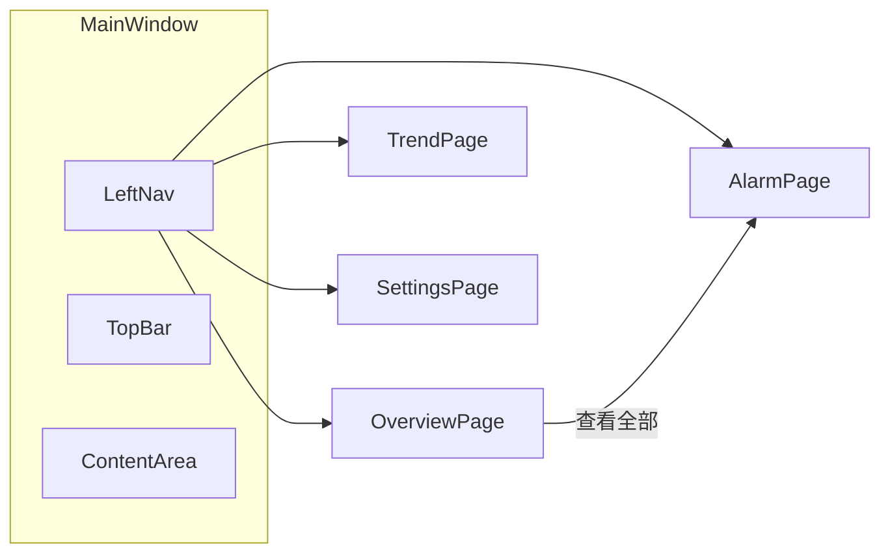

# 集成光源监控系统 — UI 原型说明

本文档描述 **已实现** 的界面原型：暗色工业监控（SCADA/HMI）风格，基于 WPF + HandyControl 深色皮肤（`SkinDark`）与自定义色板统一视觉。

---

## 1. 设计定位

| 维度 | 说明 |
|------|------|
| 风格 | 深色底 + 低饱和蓝紫辅助色 + 高对比状态色（绿/琥珀/红），适合工控机长时观看 |
| 参考 | 需求 Spec 中的「典型 SCADA HMI：多设备状态 + 实时值 + 趋势」 |
| 框架 | HandyControl 暗色主题 + 自绘导航与卡片，数值区统一 **Consolas** 等宽字体 |
| 窗口 | 默认最大化，客户区与非客户区背景统一为深灰蓝（`#151525`） |

---

## 2. 全局色板（与实现对齐）

| 用途 | 色值 | 说明 |
|------|------|------|
| 窗口/内容底色 | `#151525` | 主背景 |
| 顶栏 / 侧栏 / 嵌套块 | `#1B1B2F` | 次级面板 |
| 卡片 / 工具条 | `#23233D` | 内容卡片、趋势工具栏 |
| 选中导航 / 浮层感 | `#2D2D4A` | 左侧导航选中项背景 |
| 分割线 / 细边框 | `#334466` / `#2A2A3E` | 顶栏底边、表格线 |
| 主文字 | `#E8E8F0` | 标题、主读数 |
| 次要文字 | `#9898B0` | 标签、表头 |
| 弱化文字 | `#55556A` | 占位、版本号 |
| 状态：正常 | `#00E676` | 在线、全局正常（可呼吸动画） |
| 状态：警告 | `#FFAB00` | 通道告警边框 |
| 状态：严重 | `#FF1744` | 严重告警、全局告警 |
| 状态：离线 | `#616161` | 设备/通道离线指示 |
| 强调蓝 | `#448AFF` | 选中导航、链接按钮 |
| 强调紫 | `#7C4DFF` | 「模拟模式」角标、设置中模式文字 |
| WBA 温度 | `#FF9800` | 温度 KPI |
| WBA 气压 | `#00E5FF` | 气压 KPI |

---

## 3. 主窗体线框（壳层）

左侧 **72px** 图标导航 + 顶栏 **56px** 状态条 + 右侧内容区 **16px** 边距。

```
+------------------------------------------------------------------+
| ● 集成光源监控系统  [模拟模式]     运行: xx  最后采集: xx  ● 正常 |  <- 顶栏 #1B1B2F
+---+--------------------------------------------------------------+
| 📊|                                                              |
| 总|                    内容区 #151525                             |
| 览|                    (CurrentPage)                            |
|---|                                                              |
| 📈|                                                              |
| 趋|                                                              |
| 势|                                                              |
|---|                                                              |
| 🔔|                                                              |
| 告|                                                              |
| 警|                                                              |
|---|                                                              |
| ⚙ |                                                              |
| 设|                                                              |
| 置|                                                              |
|---|                                                              |
|v1 |                                                              |
+---+--------------------------------------------------------------+
     ^ 侧栏 #1B1B2F，选中项 #2D2D4A + 图标/文字 #448AFF
```

**顶栏信息**

- 左侧：品牌点（`#448AFF`）+ 标题 + 模拟模式时紫色胶囊「模拟模式」。
- 右侧：运行时长、最后采集时间（Consolas）、全局状态圆点（正常时绿色呼吸动画；告警时红色）+ 状态文案。

**导航项（自上而下）**

| 顺序 | 文案 | 含义 |
|------|------|------|
| 0 | 总览 | 多设备实时面板 |
| 1 | 趋势 | 历史曲线 |
| 2 | 告警 | 告警列表与筛选 |
| 3 | 设置 | 设备 / 采集 / 邮件 / TMS 等 |

---

## 4. 页面级原型

### 4.1 总览（Overview）

**布局**：上区三列（约 **3 : 2 : 固定窄栏**）+ 下区通栏「最新告警」。

```
+------------------------+------------------+--------------+
| PD 设备列表             | 波长计（多路）    | WBA 设备列表 |
| #23233D 圆角卡片        | DataGrid 暗色表  | 窄列卡片     |
|                        |                  |              |
| [设备 Expander]         | 序号|波长|功率   | SN + 在线点  |
|  ● 在线  通道数         | ...              | 温度 2x2 网格|
|  [WrapPanel 通道小卡]   |                  | 电压 2x2     |
|  ● 状态点 通道名        |                  | 气压         |
|  大号 Consolas 数值     |                  |              |
|  边框随告警变色         |                  |              |
+------------------------+------------------+--------------+
| 最新告警                                    [查看全部 >]   |
| 左色条 + 时间 + 设备 + 通道 + 等级 + 摘要                  |
+----------------------------------------------------------+
```

**交互要点**

- **PD 通道卡**：在线绿点；离线整体变淡；警告/严重对应琥珀/红边框加粗；悬停 ToolTip 展示 Spec/Min/Max/Delta/更新时间。
- **波长计**：暗色 `DataGrid`，交替行 `#23233D` / `#1B1B2F`。
- **WBA**：在线时边框略偏绿；温度/电压/气压分区小 KPI 块。
- **最新告警**：「查看全部」跳转告警页（导航索引 2）。

---

### 4.2 趋势（Trend）

```
+----------------------------------------------------------+
| [#23233D 工具条]                                          |
| 时间范围 [Combo]  类型 ○功率 ○波长（标称）  [刷新][CSV][PNG]|
+----------------------------------------------------------+
|                                                          |
|              [#23233D 图表区 LiveCharts]                  |
|              横向 Zoom，Tooltip 在上，图例在下            |
|                                                          |
+----------------------------------------------------------+
| 状态说明文字                          数据点: n (Consolas)|
+----------------------------------------------------------+
```

**说明**：图表使用 LiveCharts2 暗色主题配置（`App.xaml.cs` 中 `AddDarkTheme`），与全局背景协调。

---

### 4.3 告警（Alarm）

```
+----------------------------------------------------------+
| 筛选 [等级] [时间] [搜索通道...] [刷新] 共 n 条  [静音]    |
+----------------------------------------------------------+
| DataGrid 暗色表                                           |
| ● | 时间 | 通道 | 类型 | 等级 | 测量值 | Spec | Delta ... |
+----------------------------------------------------------+
```

**说明**：首列等级色圆点；行虚拟化以支撑长列表；静音为 Toggle。

---

### 4.4 设置（Settings）

**结构**：顶部 `TabControl`，选中 Tab 文字 `#448AFF`，未选中 `#9898B0`。

- **设备管理**：`Expander` + 内嵌 `#1B1B2F` 块展示驱动状态（模式紫、状态绿等）。
- 其余 Tab（采集、邮件、TMS 等，以实际 XAML 为准）：表单控件沿用 HandyControl 暗色样式，区块同样采用 `#23233D` 圆角容器。

---

## 5. 信息层次与组件模式

1. **状态优先**：椭圆色块（设备/通道/全局）一眼区分正常、告警、离线。
2. **数值可读**：主测量值 `FontSize` 偏大（如 22–40）+ **Consolas**，与标签灰字区分。
3. **分区卡片**：圆角 **8px**，内层 **`#1B1B2F`** 再嵌套，形成工业面板层次。
4. **可操作入口**：链接式「查看全部」「#448AFF」文字按钮，减少视觉噪音。

---

## 6. 导航与页面关系（示意）



---

## 7. 源码索引（便于对照实现）

| 说明 | 路径 |
|------|------|
| 全局主题与资源 | `src/LightSourceMonitor/App.xaml` |
| 主壳、导航、顶栏 | `src/LightSourceMonitor/Views/MainWindow.xaml` |
| 总览 | `src/LightSourceMonitor/Views/OverviewPage.xaml` |
| 趋势 | `src/LightSourceMonitor/Views/TrendPage.xaml` |
| 告警 | `src/LightSourceMonitor/Views/AlarmPage.xaml` |
| 设置 | `src/LightSourceMonitor/Views/SettingsPage.xaml` |

---

*文档版本与程序一致时可与 [集成光源监控工具-技术方案.md](集成光源监控工具-技术方案.md) 一并作为交付说明。*
