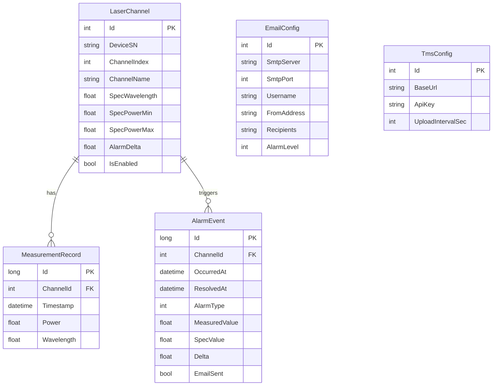
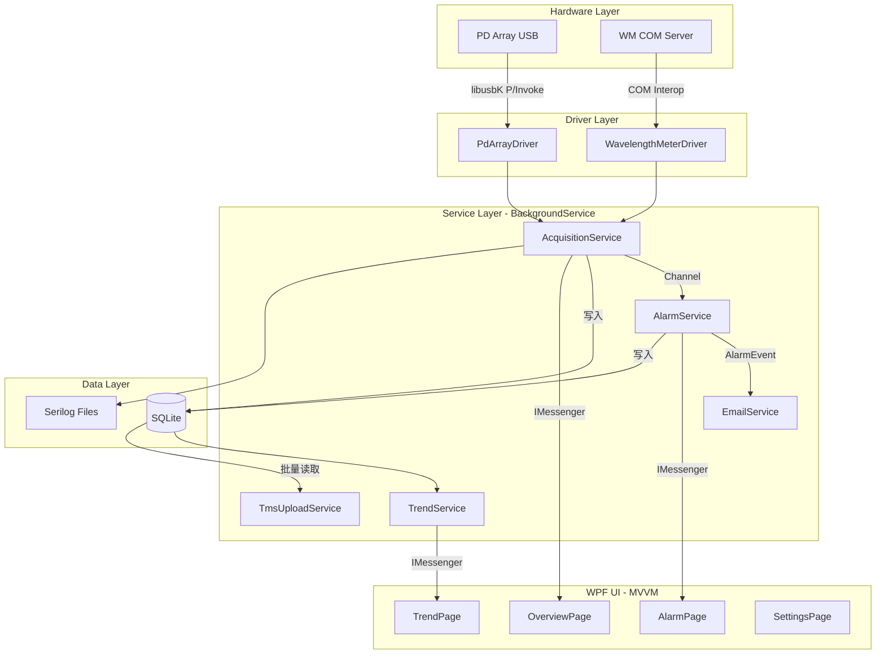

# 集成光源监控工具 — WPF 重构实施计划

## 1. 现有 C++ 代码分析摘要

现有 MFC 应用的核心逻辑集中在以下几个文件中，新项目需要逐一迁移：

| 原始文件 | 职责 | 迁移方式 |
|---|---|---|
| `CPDArry` (PDArry.cpp/h) | libusbK USB 控制传输读取 PD 功率 | C++/CLI 包装 DLL 或 P/Invoke |
| `CMFCApplication1Dlg` WM 部分 | COM Automation 调用 UDL2_Server.dll | .NET COM Interop (tlbimp) |
| `PDConfig.ini` / `WMConfig.ini` | 设备通道配置、告警阈值 | 迁移为 JSON 配置 + Settings UI |
| CSV 日志 | 按时间戳文件夹存储 | 改为 SQLite + 可选 CSV 导出 |

### 硬件通信关键参数（从 C++ 代码提取）

**PD 阵列 (USB)**:
- VID=`0x05A6`, PID=`0x49A5`
- Control Transfer: MFG 模式 (request `0xFF`, type `0x44`, payload `"MFG_CMD"`)
- 功率读取: request `0xFF`, type `0xC4`, value `0x000A`, 每通道 2 字节 LE uint16, 实际功率 = raw / 100.0
- 最多 33 通道 (`MAX_PD_CHANNEL`)

**波长计 (COM)**:
- CoClass: `UDL2_Engine` + `UDL2_WM`
- 关键方法: `LoadConfiguration`, `OpenEngine`, `SetWMParameters`, `ExecuteWMSingleSweep`, `GetWMChResult`

---

## 2. 技术栈确认

```
.NET 8 / C# / WPF
CommunityToolkit.Mvvm          (MVVM 基础设施)
HandyControl                   (UI 控件库)
LiveChartsCore.SkiaSharpView.WPF (趋势图)
Microsoft.EntityFrameworkCore.Sqlite (本地持久化)
MailKit                        (邮件告警)
Microsoft.Extensions.Hosting   (DI + BackgroundService)
Serilog                        (结构化日志)
System.IO.Ports / libusbK      (硬件通信)
```

---

## 3. 项目结构设计

```
LightSourceMonitor.sln
├── src/
│   ├── LightSourceMonitor/                # 主 WPF 应用
│   │   ├── App.xaml / App.xaml.cs         # Hosting 启动
│   │   ├── Models/
│   │   │   ├── LaserChannel.cs            # 单通道实体
│   │   │   ├── MeasurementRecord.cs       # 采样记录
│   │   │   ├── AlarmEvent.cs              # 告警事件
│   │   │   └── AppSettings.cs             # 强类型配置
│   │   ├── ViewModels/
│   │   │   ├── MainViewModel.cs           # Shell / 导航
│   │   │   ├── OverviewViewModel.cs       # 总览仪表盘
│   │   │   ├── TrendViewModel.cs          # 趋势图页
│   │   │   ├── AlarmViewModel.cs          # 告警列表页
│   │   │   ├── SettingsViewModel.cs       # 配置页
│   │   │   └── DeviceStatusViewModel.cs   # 设备详情
│   │   ├── Views/
│   │   │   ├── MainWindow.xaml            # NavigationWindow
│   │   │   ├── OverviewPage.xaml          # SCADA 风格总览
│   │   │   ├── TrendPage.xaml             # LiveCharts2 趋势
│   │   │   ├── AlarmPage.xaml             # 告警历史 DataGrid
│   │   │   └── SettingsPage.xaml          # SMTP/阈值/TMS 配置
│   │   ├── Services/
│   │   │   ├── Acquisition/
│   │   │   │   ├── IAcquisitionService.cs
│   │   │   │   └── AcquisitionBackgroundService.cs
│   │   │   ├── Alarm/
│   │   │   │   ├── IAlarmService.cs
│   │   │   │   └── AlarmService.cs
│   │   │   ├── Email/
│   │   │   │   ├── IEmailService.cs
│   │   │   │   └── EmailService.cs
│   │   │   ├── Tms/
│   │   │   │   ├── ITmsService.cs
│   │   │   │   └── TmsUploadService.cs
│   │   │   └── Trend/
│   │   │       ├── ITrendService.cs
│   │   │       └── TrendService.cs
│   │   ├── Data/
│   │   │   ├── MonitorDbContext.cs         # EF Core DbContext
│   │   │   └── Migrations/
│   │   ├── Drivers/
│   │   │   ├── ILightSourceDriver.cs      # 设备抽象接口
│   │   │   ├── PdArrayDriver.cs           # libusbK P/Invoke
│   │   │   ├── WavelengthMeterDriver.cs   # COM Interop
│   │   │   └── Native/
│   │   │       ├── LibUsbKNative.cs       # P/Invoke 签名
│   │   │       └── UsbTypes.cs            # 结构体定义
│   │   ├── Converters/
│   │   └── Assets/
│   └── LightSourceMonitor.Tests/          # 单元测试
└── libs/
    ├── libusbK.dll                        # 运行时依赖
    └── UDL2_Server.dll                    # COM 组件
```

---

## 4. 数据库 ER 设计 (SQLite + EF Core)



**存储策略**:
- 实时采样间隔约 2s（与原 C++ 一致），但只有每 N 次（可配置，默认 10）才落库
- 超过 30 天的 `MeasurementRecord` 自动聚合为小时均值后删除原始数据
- `AlarmEvent` 永久保留

---

## 5. 核心架构数据流



---

## 6. 分阶段实施步骤

### Phase 1: 项目脚手架 + 基础 UI Shell

- 创建 .NET 8 WPF 项目，配置 `Microsoft.Extensions.Hosting` 作为 DI 容器
- 安装所有 NuGet 包（HandyControl, CommunityToolkit.Mvvm, LiveCharts2, EF Core SQLite, MailKit, Serilog）
- 实现 `MainWindow.xaml`：左侧导航栏（总览/趋势/告警/设置），右侧内容区
- 搭建 MVVM 基础设施：ViewModelBase、NavigationService、ViewLocator
- HandyControl 主题配置（深色工业风格）

### Phase 2: 数据层

- 定义 EF Core 实体：`LaserChannel`, `MeasurementRecord`, `AlarmEvent`, `EmailConfig`, `TmsConfig`
- 实现 `MonitorDbContext`，配置索引（Timestamp + ChannelId 复合索引用于趋势查询）
- 创建初始 Migration
- 实现数据清理策略（30 天聚合）

### Phase 3: 硬件驱动层

#### 3a. PD 阵列驱动 (libusbK P/Invoke)

将 C++ `CPDArry` 的逻辑翻译为 C# P/Invoke：

```csharp
// 核心 P/Invoke 签名 (从 libusbk.h 翻译)
[DllImport("libusbK.dll")] static extern bool LstK_Init(out IntPtr DeviceList, KLST_FLAG Flags);
[DllImport("libusbK.dll")] static extern bool LstK_MoveNext(IntPtr DeviceList, out IntPtr DeviceInfo);
[DllImport("libusbK.dll")] static extern bool LibK_LoadDriverAPI(out KUSB_DRIVER_API DriverAPI, int DriverId);
// ... ControlTransfer 等
```

关键迁移点：
- `Open()`: 枚举 VID=0x05A6 PID=0x49A5，匹配 InstanceID 子串
- `Initialize()`: 发送 MFG_CMD + 设置高功率模式
- `GetActualPower()`: Control Transfer (0xC4, 0xFF, 0x000A)，解析 LE uint16 / 100.0

#### 3b. 波长计驱动 (COM Interop)

- 使用 `tlbimp.exe` 或直接 `dynamic` COM 调用生成 .NET 互操作包装
- 封装 `WavelengthMeterDriver` 实现 `ILightSourceDriver` 接口
- 方法映射: `Init() -> LoadConfiguration + OpenEngine`, `Measure() -> SetWMParameters + ExecuteWMSingleSweep + GetWMChResult`

### Phase 4: 数据采集服务

- 实现 `AcquisitionBackgroundService : BackgroundService`
- 采集循环：每 2s 读 PD 功率，每 N 次（可配置）执行一次 WM 扫频
- 通过 `Channel<MeasurementRecord>` 发布到告警服务和 UI
- 使用 `CommunityToolkit.Mvvm` 的 `IMessenger` (WeakReferenceMessenger) 通知 UI 更新
- 落库策略：每 10 次采样存 1 条到 SQLite
- Serilog 记录每次采集日志（含异常和耗时）

### Phase 5: 告警服务

- `AlarmService` 订阅采集数据流，与 `LaserChannel.SpecXxx` 和 `AlarmDelta` 比较
- **GUI 告警**:
  - Overview 页面每个通道用 `Ellipse`（绿/黄/红）+ HandyControl `Poptip` 显示详情
  - 全局 `Growl` 通知（HandyControl Toast）
  - AlarmPage DataGrid 实时刷新，支持声音提示（SystemSounds）
- **邮件告警**:
  - MailKit 异步发送 HTML 邮件
  - 邮件内容：超限参数 + 最近 1 小时趋势截图（RenderTargetBitmap -> PNG 附件）
  - 防重复：同一通道同一告警类型 1 小时内只发 1 次
- 告警级别: Warning (接近阈值 80%) / Critical (超出阈值)

### Phase 6: 趋势图页面

- 使用 LiveCharts2 `CartesianChart`
- 支持多激光器通道叠加曲线（不同颜色）
- X 轴: 时间（最近 7 天，可缩放拖拽）
- Y 轴: 功率 (dBm) 或波长 (nm)，双轴可选
- 鼠标悬停 Tooltip 显示精确值和通道名
- 导出按钮：CSV 数据 / PNG 截图
- 数据源：从 SQLite 按时间范围 + 通道 ID 查询

### Phase 7: 设置页面

- SMTP 配置（服务器/端口/用户名/密码/收件人列表）
- 告警阈值配置（每通道的 Spec 波长、功率范围、Delta）
- TMS 对接配置（BaseUrl, ApiKey, 上传间隔）
- 采集参数（采样间隔、落库比率、WM 扫频间隔）
- 设备管理（PD 阵列 SN 列表、通道启用/禁用）
- 所有配置持久化到 SQLite，运行时可热更新

### Phase 8: TMS 上传

- `TmsUploadService : BackgroundService`
- 定期（可配置间隔）批量读取未上传的 `MeasurementRecord`
- HTTP POST JSON 到 TMS API
- Polly 策略：指数退避重试 3 次 + 熔断（连续 5 次失败后暂停 30s）
- 上传成功后标记记录为已同步

### Phase 9: 总览仪表盘 (SCADA 风格)

- 顶部状态栏：系统运行时长、采集次数、最后采集时间、全局健康状态
- 中部：卡片网格布局，每个激光器通道一张卡片
  - 通道名称、当前功率/波长值
  - 状态指示灯 (Ellipse: 绿/黄/红)
  - 迷你 Sparkline (最近 1 小时趋势)
- 底部：最近 10 条告警滚动条

### Phase 10: 健壮性与 7x24 运行保障

- 全局异常处理 (`DispatcherUnhandledException` + `TaskScheduler.UnobservedTaskException`)
- 驱动断连自动重连（指数退避）
- 内存泄漏防护：定期 GC.Collect 提示 + WeakReference 事件
- 日志文件自动滚动（Serilog RollingFile，30 天保留）
- SQLite WAL 模式避免读写锁竞争

---

## 7. 原 C++ 代码中需注意的 Bug / 设计问题

迁移时应修复以下问题：

1. **`strValue.Find("0") == -1` 通道判断 Bug**: 原代码用 `Find("0")` 判断通道是否禁用，导致 PD10/PD20/PD30 等含 `0` 的编号被误判为禁用。新代码应直接比较整数值。

2. **WMConfig 键名不一致**: 原代码用 `Format(_T("WM%d"), WMArray_Num)` 取 max 波长，但 min 波长始终读 `"WM1"` 键。新配置应使用明确的 `WmStartWavelength` / `WmStopWavelength` 字段。

3. **无工作线程**: 原 MFC 用 `Sleep()` 阻塞 UI 线程 + `YieldToPeers()`。新架构使用 `BackgroundService` + `async/await` 彻底解耦。

4. **WM CSV 缺少数据列**: 原代码 WM CSV 只写了时间戳未写波长值。新系统统一通过 SQLite 存储。

5. **COM 未 Uninitialize**: 新代码在 Driver Dispose 中确保 `Marshal.ReleaseComObject`。
