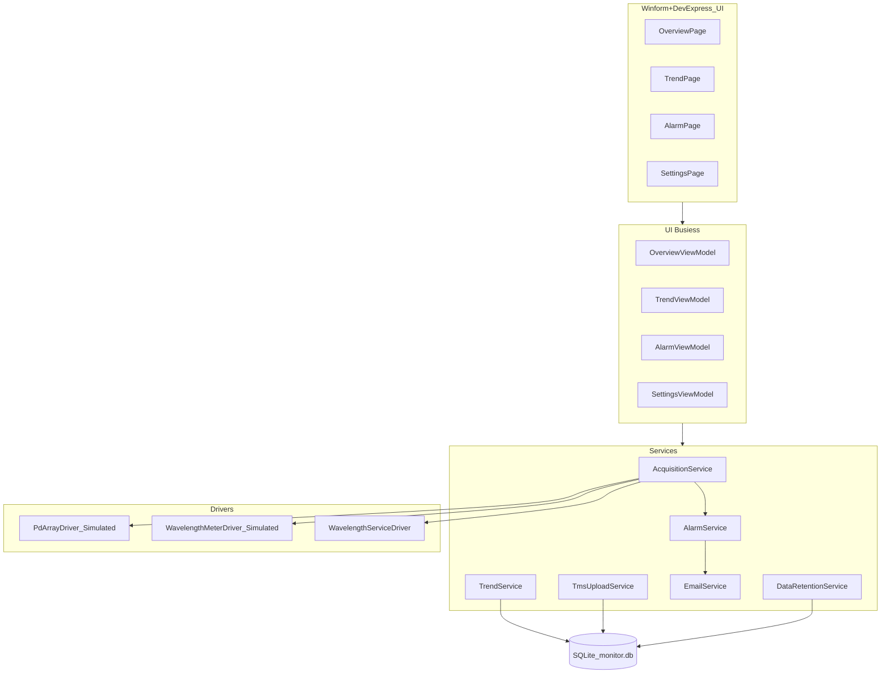

# 集成光源监控系统 — 技术方案

## 目标

部署于 Windows 工控机的 **7×24 集成光源健康监控** 客户端：稳定性可视化、异常可感知（界面 + 通知）、趋势可回溯、数据可对接工厂信息系统（TMS）

## 需求讨论和分解

- **稳定性可视化**：总览页展示多设备/多通道实时功率与波长相关状态；连接状态、全局状态条等与采集服务联动。
- **异常可感知**：功率/波长相对 Spec 漂移超阈值时产生告警事件；界面告警列表与提示；邮件侧通过可配置的 **HTTP 邮件 API** 投递
- **趋势可回溯**：SQLite 持久化测量记录；趋势页按时间范围查询，大数据量时使用 LTTB 降采样；后台任务按策略清理历史数据。
- **对接 TMS**：将未同步的 `MeasurementRecords` 批量 POST 为 JSON 至可配置 BaseUrl；支持 API Key 与连接探测。

## 初步技术构思

NET 8、Winform+DevExpress、x86

LiveCharts2

MailKit 邮件

HttpClient + Polly（TMS）

EF Core SQLite

Serilog

**运行平台**：`PlatformTarget` 为 **x86**，与随包复制的 `libusbK.dll`、`UDL2_Server.dll` 一致。

---

## 总体架构

- **表现层**：Winform+DevExpress UI风格采用暗色主题 符合工业风格
- **逻辑层**：后台处理所有UI的数据上报UI交互事件。
- **驱动层**：真实硬件下 PD 通过 **P/Invoke libusbK.dll**；波长计相关通过 **UDL2_Server.dll** 等与既有 C++ 能力衔接；波长表数据通过 **Socket 或串口模拟** 的 `IWavelengthServiceDriver` 拉取；支持 **Simulated** 模式便于无设备验证。
- **数据层**：EF Core + SQLite（`PRAGMA journal_mode=WAL`），迁移与遗留库修复见 `LegacySchemaRepair`。

---

## 详细方案

### 数据采集与存储策略

#### 采集循环

- **周期**：由 `SamplingIntervalMs` 控制两次循环间隔（默认 **5000 ms**，合法下限 100 ms）；满足 Spec「不必每次落库」前的**实时刷新**节奏。
- **波长表扫频**：每 `WmSweepEveryN` 个周期执行一次波长服务拉表（默认 **20**，与采样间隔组合决定波长表刷新频率）。
- **落库稀疏化**：每 `DbWriteEveryN` 个周期将本批 `MeasurementRecord` 写入 SQLite（默认 **20**）；第 1 周期也会写入，避免长期无点。
- **与需求「例如 10 次存一次」**：可通过设置页/数据库表 `AcquisitionConfig` 将 `DbWriteEveryN` 调整为 **10**（或按现场磁盘与趋势精度折中）。
- **UI 与 DB 解耦**：先触发 `DataAcquired` / `WavelengthTableUpdated` 等事件刷新界面，再异步写库与告警评估，避免界面被 IO 阻塞。
- **容错**：连续异常超过阈值时暂停采集 30 秒；PD 读失败按计数触发重连。

#### 数据模型与 ER 关系

- **LaserChannel**：由 `appsettings.json` 的 `Driver.Devices[].Channels` 与 [ChannelCatalog](src/LightSourceMonitor/Services/Channels/ChannelCatalog.cs) 提供运行时通道目录（非独立 EF 表）。
- **MeasurementRecord**：`ChannelId`, `Timestamp`, `Power`, `Wavelength`, `IsSyncedToTms`；索引 `(ChannelId, Timestamp)`、`IsSyncedToTms`。
- **AlarmEvent**：关联 `ChannelId`，记录类型、等级、测量/Spec/Delta、邮件是否已发等。
- **AcquisitionConfig**：单行配置采样与落库参数。
- **EmailConfig / TmsConfig**：界面或库内配置，供邮件网关与 TMS 使用。

#### 数据保留

- 测量数据默认保留 **30** 天，告警默认 **90** 天；按小时任务批量删除，控制单次批量大小，避免长事务锁库。

---

### 告警与通知方案

#### 告警规则

- **功率**：以通道 `SpecPowerMin/Max` 中点为参考，`|Power - 中点| > AlarmDelta` 触发；超 `1.5×AlarmDelta` 为 Critical，否则 Warning。
- **波长**：`|Wavelength - SpecWavelength| > 0.05 nm` 触发漂移告警（分级阈值 0.1 nm）。
- 事件写入 `AlarmEvents` 表并 `AlarmRaised` 通知 UI。

#### 邮件防重复

- 按「设备 SN + 通道名 + 告警类型」节流；最小间隔由 `AlarmEmail:MinIntervalMinutes` 配置，代码侧限制在 **30 分钟～24 小时** 之间。
- 同一时刻仅一条发送任务（`SemaphoreSlim`）。

#### 界面告警

- 总览：通道状态色、HandyControl 提示等（与 [OverviewPage](src/LightSourceMonitor/Views/OverviewPage.xaml)、[OverviewViewModel](src/LightSourceMonitor/ViewModels/OverviewViewModel.cs) 一致）。
- 告警页：[AlarmPage](src/LightSourceMonitor/Views/AlarmPage.xaml) + [AlarmViewModel](src/LightSourceMonitor/ViewModels/AlarmViewModel.cs) 列表与导航索引 **2** 对应（总览 0、趋势 1、告警 2、设置 3，见 [MainViewModel](src/LightSourceMonitor/ViewModels/MainViewModel.cs)）。

---

### 趋势分析

- 按通道与时间范围从 `MeasurementRecords` 查询；点数超过 `maxPoints`（默认 2000）时使用 **LTTB** 降采样，兼顾 **7 天级** 趋势的可读性与性能。
- 多通道查询合并后按时间排序，供 LiveCharts 多系列展示（具体绑定见 [TrendViewModel](src/LightSourceMonitor/ViewModels/TrendViewModel.cs) / [TrendPage](src/LightSourceMonitor/Views/TrendPage.xaml)）。

---

### TMS 对接

- 从库读取 `TmsConfig`：`IsEnabled`、`BaseUrl`、`ApiKey`。
- 每次最多取 **500** 条 `IsSyncedToTms == false` 的记录，POST 至 `{BaseUrl}/measurements`，JSON 字段含 `ChannelId`、`Timestamp`（ISO8601）、`Power`、`Wavelength`。
- 成功则批量标记 `IsSyncedToTms`。
- `TestConnectionAsync`：GET `{BaseUrl}/health` 探测连通性。

*与 Spec 的假设一致：HTTP + JSON；生产环境建议补充 TLS、鉴权轮换及 Polly 重试策略。*

---

### 配置与部署要点

- **主配置**：[appsettings.json](src/LightSourceMonitor/appsettings.json) — `Driver.Mode`（`Simulated` / `Hardware`）、设备 SN、USB 路径、通道 Spec 与告警增量；`WavelengthService`（Socket / `SimulatedCom` 等）。
- **数据库**：程序目录下 `monitor.db`，启动时 `MigrateAsync`；采集参数可存 `AcquisitionConfigs`。
- **原生依赖**：输出目录需包含 `libusbK.dll`、`UDL2_Server.dll` 及可选 `config\UDL_WM.xml`（真实波长计场景）。
- **全局异常**：UI 与域未处理异常写入 Serilog，避免静默崩溃。

---

### 稳定性与性能考虑

- WAL 模式减轻读写争用；测量写入按 N 次采样批量提交。
- 趋势查询侧通过 LTTB 控制点数；保留任务分批删除。
- 采集循环与 UI 通过事件分离；连续失败退避。
- 模拟模式覆盖 PD、波长计、波长服务、WBA，便于功能验收与演示。

