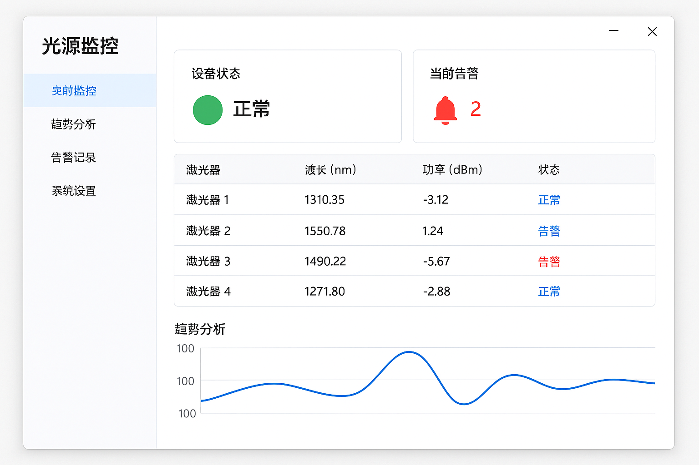

# 集成光源监控工具需求


集成光源是光通信领域给予所有自动化测试工位的多播光源，设备大，复杂，所以我们要监控它的稳定性，做到及时预警

工具本质是一个 **7x24 的集成光源健康监控系统**，核心目标是：

- **稳定性可视化**
- **异常可感知（GUI + 邮件）**
- **趋势可回溯**
- **数据能进入工厂信息系统（TMS）**


## 基础功能需求

1.漂亮的界面;

2.波长或者功率超出spec GUI告警，并邮件告警给指定人;

3.数据日志不需要全部保存，比如10次就存储一次,要有趋势显示功能(比如显示最近7天来某个激光器的波长变化趋势);

4.数据可以上传到TMS系统;


## 选型技术栈

放在Windows工控机上面的GUI监控工具


选型采用

.NET 8 C# WPF

MVVM框架采用CommunityTookit.Mvvm最新稳定版本

UI框架采用最新稳定版本的HandyControl

曲线绘制可以自行思考 比如LiveCharts2【首选】或者OxyPlot


- CommunityToolkit.Mvvm
- HandyControl
- LiveChartsCore.SkiaSharpView.WPF
- Microsoft.EntityFrameworkCore.Sqlite
- MailKit
- Microsoft.Extensions.Hosting


```
┌─────────────────────────────┐
│           WPF UI             │
│  (HandyControl + Charts)     │
└─────────────▲───────────────┘
              │  MVVM
┌─────────────┴───────────────┐
│      应用服务层 (Services)   │
│  ┌────────┐  ┌──────────┐   │
│  │告警服务│  │趋势服务  │   │
│  └────────┘  └──────────┘   │
│  ┌────────┐  ┌──────────┐   │
│  │数据采集│  │TMS上传  │   │
│  └────────┘  └──────────┘   │
└─────────────▲───────────────┘
              │
┌─────────────┴───────────────┐
│      设备抽象层 (DAL)        │
│   ILightSourceDriver         │
└─────────────▲───────────────┘
              │ P/Invoke / 重写
┌─────────────┴───────────────┐
│     现有 C++ 驱动 / DLL      │
└─────────────────────────────┘
```


## UI假想图

典型SCADA HMI——多设备状态 + 实时值 + 趋势，工业监控经典风格




## 业务和驱动参考

现有文件夹是一个简陋的C++ MFC编写的监控工具 它写了底层驱动 然后获取基础的波长和功率数据

这个是可以直接参考的 


## 方案设计思路

### 告警服务（核心）

**GUI告警**：

- Overview页面每个激光器用HandyControl的Poptip + 彩色Ellipse（绿/黄/红）。
- 全局Toast（HandyControl Growl）。
- 报警列表页面实时刷新 + 声音提示。

**邮件告警**：

- 使用**MailKit**（异步、支持HTML）。
- 邮件内容：当前超限值 + 最近1小时趋势截图（用RenderTargetBitmap生成PNG附件）。
- 支持SMTP配置（Gmail/企业邮箱）、收件人列表、告警级别（Warning/Critical）。
- 防重复：同一参数1小时内只发1次邮件。


### 数据采集与存储策略

采样 & 落库解耦

Serilog存储采集日志


### 数据存储策略

采用sqlite存储到本地

数据表设计请参考代码先规划ER关系


### 趋势图

**趋势页面功能**：

- 支持多激光器叠加曲线（不同颜色）。
- 时间范围：最近7天（可缩放、拖拽）。
- 导出CSV/PNG。
- 鼠标悬停显示精确值。


### 邮件告警设计


### TMS 系统对接方案

假设 TMS 支持：

✅ HTTP API
✅ JSON

HttpClient + Polly（重试+熔断）